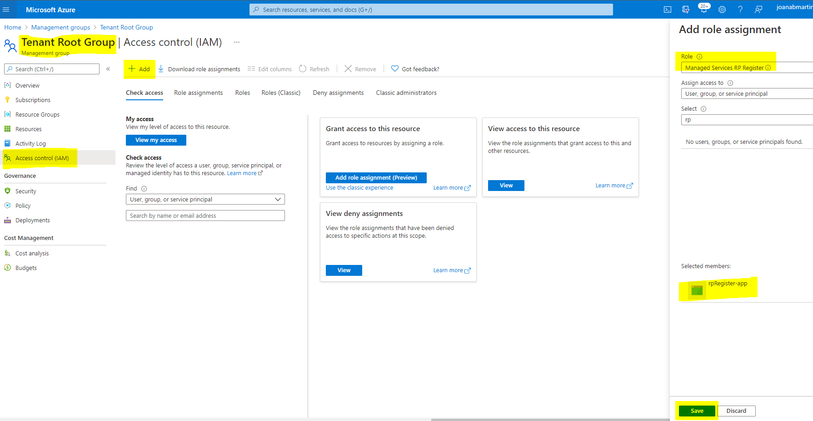

# Use a logic app in the customer environment to automatically register the Managed Services resource provider in all subscriptions

<br/>

[](https://portal.azure.com/#create/Microsoft.Template/uri/https%3A%2F%2Fraw.githubusercontent.com%2FAzure%2FAzure-Lighthouse-samples%2Fmaster%2Ftemplates%2Fregister-managed-services-rp-customer%2Fazuredeploy.json)

 <br/>

This template will deploy a logic app that will use its identity to register the Managed Services resource provider in all subscriptions. This will help the policy to deploy Azure Lighthouse at the Management Group level to properly work, without having to register the managed services resource provider manually. 

The logic app that you find here is intended to be **deployed for each customer**. There is a similar example in this repository, where you can find a logic app that will do the same thing, but you can deploy that in the partner environment.

The logic app is configured to run every day, but you can change that trigger to better suit your needs.

## **Post-Deployment configurations**
## 1- Assign permissions to the logic app system identity to be able to register the resource provider in each subscription
You need to manually give permissions to the logic app system assigned identity to be able to get all subscriptions and register the managed services resource provider in each subscrption.

You can give this identity the role of contributor at the root management group level, but that goes against the principle of least privilege. We advise you to create a more granular role (in each customer). This role will only give permission to register the managed services provider. 

### **1.1 Create and assign a custom role to the managed identity**

There are multiple ways to [create a custom role definition](https://docs.microsoft.com/en-us/azure/role-based-access-control/custom-roles). We created a template that you can use, it is in the file *managedServicesRPRegister-role.json*.

In that file, fill the *assignables scopes* field with the customer [Root Management Group ID](https://docs.microsoft.com/en-us/azure/governance/management-groups/overview#important-facts-about-the-root-management-group) (also known as the customer tenant ID):

```json
"AssignableScopes": [
      "/providers/Microsoft.Management/managementGroups/{rootMGID}"
    ]
```     
To deploy it, you can use Azure CLI or Powerhsell:

```azurecli
az role definition create --role-definition "~roles/managedServicesRPRegister-role.json"
``` 

```azurepowershell
New-AzRoleDefinition -InputFile "C:\CustomRoles\managedServicesRPRegister-role.json"
```

After you create the role, you will be able to assign that role to the logic app system assigned identity. You should assign it at the *root management group level*, so that it will find each new subscription. To find the managed identity better, you can search for the name that you gave to your logic app:

<p align="center">
  
</p>

## 


