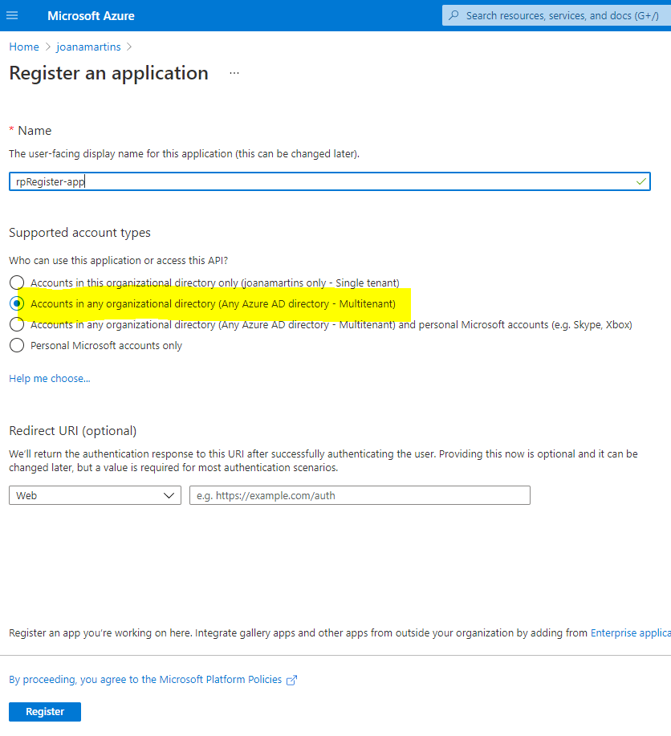
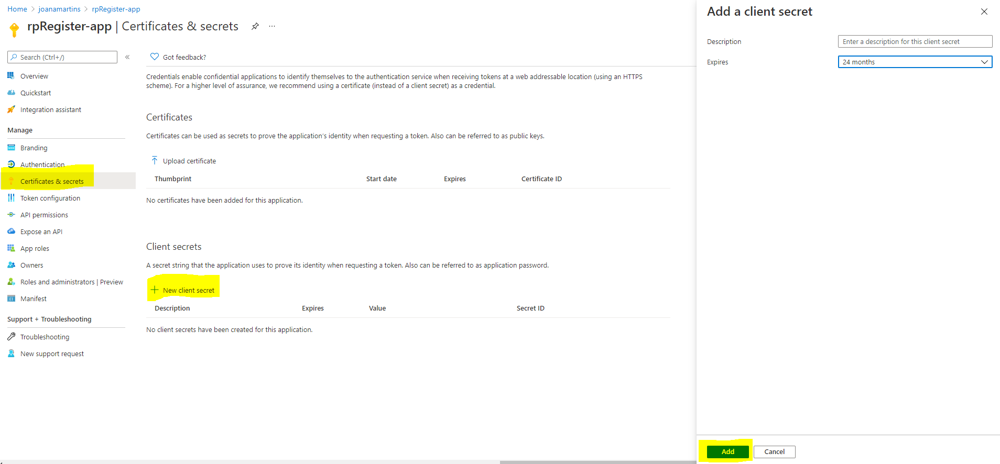
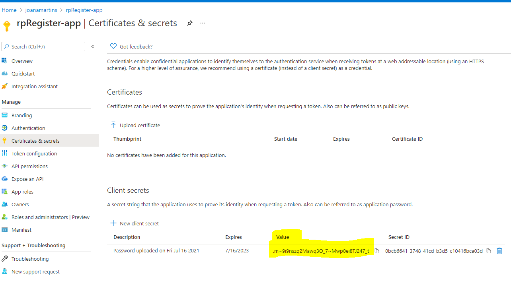

# Use a logic app from the partner environment to automatically register the Managed Services resource provider in all the customer subscriptions

<br/>

[](https://portal.azure.com/#create/Microsoft.Template/uri/https%3A%2F%2Fraw.githubusercontent.com%2FAzure%2FAzure-Lighthouse-samples%2Fmaster%2Ftemplates%2Fregister-managed-services-rp-partner%2Fazuredeploy.json)

 <br/>

This template will deploy a logic app that will find the subscription of all the customer tenants and register the Managed Services resource provider in each. This will help the policy to deploy Azure Lighthouse at the Management Group level to properly work, without you having to register the managed services resource provider manually. 

The logic app that you find here is intended to be **deployed in the partner environment**. There is a simpler example in this repository, where you can find a logic app that will do the same thing, but you will need to deploy for each customer.

The logic app is configured to run every day, but you can change that trigger to better suit your needs.

## **Pre-deployment Configurations**
## 1- Create a service principal

We are going to use an identity from the managing tenant to register the resource provider in the managed tenants. To do so, you need to go into the partner tenant and create an app registration:

 <p align="center">
  
</p>

Give it a name and select the multitenant option:

 <p align="center">
  
</p>

Get the Application (client) ID, you will need it to deploy the template.

Create a secret for your app and save it in a safe place. After you create it, you won't be able to retrive it again. 

 <p align="center">
  
</p>

<p align="center">
  
</p>

## 2- Grant your service principal access to the managed tenants

The application that you just registered in the managing tenant doesn't exist in the managed tenants. You need to [grant tenant-wide admin consent](https://docs.microsoft.com/en-us/azure/active-directory/manage-apps/grant-admin-consent#construct-the-url-for-granting-tenant-wide-admin-consent) for that application in each customer AAD. You can do it by using an URL like this:

```http
https://login.microsoftonline.com/{tenant-id}/adminconsent?client_id={client-id}
```

where:

* `{client-id}` is the application's client ID (that you retrived above).
* `{tenant-id}` is your managed tenant ID 


Now, that the app exists in each customer tenant, you need to give it permissions to be able to register the service provider in all subscriptions of those tenant. 

## 3 - Grant your service principal the right permissions for each the customer subscriptions

You need to assign a role to the service principal at the root management group so that it can register the resource provider for each new subscription. The only built-in role that is able to do so is the owner or the contributor. Assigning those role, in this scenario, goes against the principle of least privilege. We advise you to create a more granular role (in each customer) that limits the actions that the service principal can do. That role should only be able to register the managed services resource provider. 

### 3.1 Create and assign a custom role to the service principal

There are multiple ways to [create a custom role definition](https://docs.microsoft.com/en-us/azure/role-based-access-control/custom-roles). We created a template that you can use, it is in the file *managedServicesRPRegister-role.json*. 

In that file, fill the *assignables scopes* field with the customer [Root Management Group ID](https://docs.microsoft.com/en-us/azure/governance/management-groups/overview#important-facts-about-the-root-management-group) (also known as the customer tenant ID):

```json
"AssignableScopes": [
      "/providers/Microsoft.Management/managementGroups/{rootMGID}"
    ]
```     
To deploy it, you can use Azure CLI or Powerhsell:

```azurecli
az role definition create --role-definition "~roles/managedServicesRPRegister-role.json"
``` 

```azurepowershell
New-AzRoleDefinition -InputFile "C:\CustomRoles\managedServicesRPRegister-role.json"
```

After you create the role, you will be able to assign that role to the service principal:

<p align="center">
  
</p>

## **Template Deployment**
Finally, we have everything set to deploy the logic app. You can click the button above and "Deploy to Azure" the logic app in the managing tenant.

You will need to fill in the following parameters:
* Resource Group Name - where you want the logic app to be deployed to
* Location
* Logic App Name - You should follow the naming convention that you have in your organization
* Application ID - ID for the application that you created above
* Application secret - Secret that you retrived from the first step. 
* Managed tenants list - Array with all the customer tenant IDs

> [!WARNING]
> For security reasons you should save the application ID and secret in a key vault and use the logic app [system managed identity](https://docs.microsoft.com/en-us/azure/logic-apps/create-managed-service-identity) to retrive it. The logic app has [built-in connectors that can help with that](https://docs.microsoft.com/en-us/azure/logic-apps/logic-apps-securing-a-logic-app?tabs=azure-portal#secure-inputs-and-outputs-in-the-designer).

