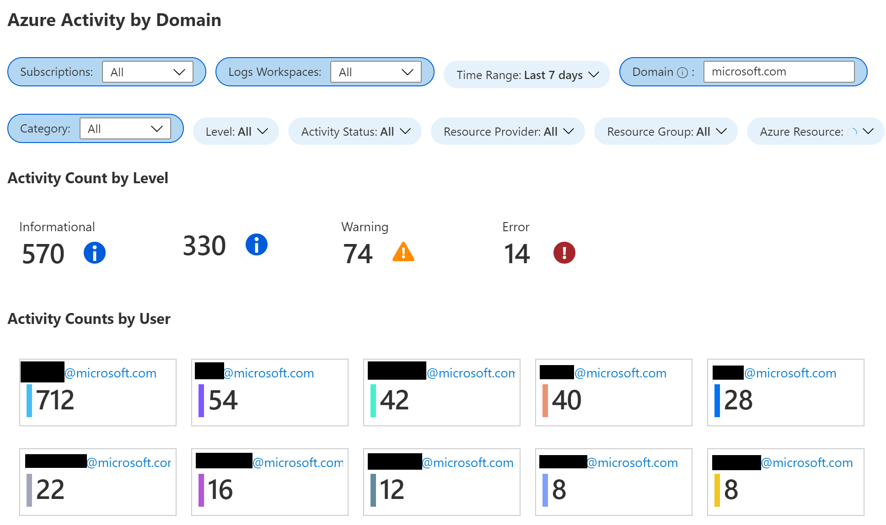
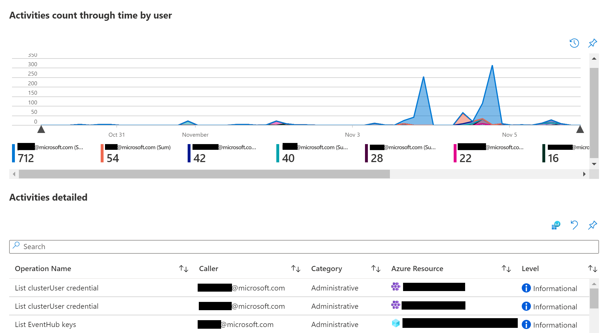
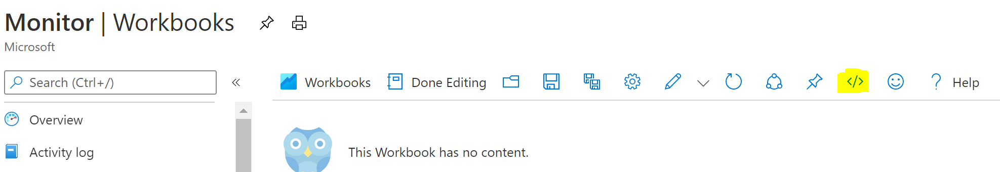
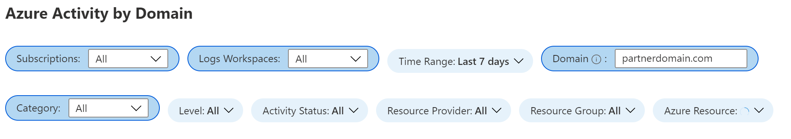

# Workbook - Activity Logs by Domain
**Author: Joana Martins | Customer Engineer, [FastTrack for Azure](https://aka.ms/fasttrackforazure)**

This workbook displays the Azure Activity Logs across subscriptions with an option to filter them by the caller domain name.

## Requirements
You need to send the Activity logs to a Log Analytics workspace.

If you are not doing that already you can check how to do it [here](https://docs.microsoft.com/en-us/azure/azure-monitor/platform/activity-log#send-to-log-analytics-workspace).

## How to deploy the workbook
1. Go to Azure Monitor -> Workbooks -> New
2. Open the _Advanced Editor_ using the _</>_ button on the toolbar.
  
  
3. Ensure you are on the _Gallery Template_ tab.
4. Paste the content of the workbook "activityLogsByDomain.json" and _Apply_ changes.
5. Save the workbook.

To deploy the workbook you will need **write permissions** in the subscription where it will be stored. 

To view the information, you will need **read permissions** of all subscriptions that are in the defined groups. 

## How to manage the workbook

For the workbook to work properly you need to select the subscription and log analytics workspace where you are sending the activity logs to.

You can filter the results by the domain of the users. You need to write next to the _Domain_ parameter the domain name.

The workbook also has multiple other filters that you can apply like _Category, Level_, or the _Resource Group_ where the activities that you want to monitor happenned.

