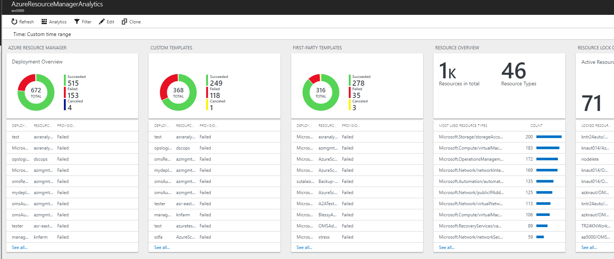
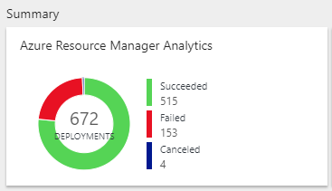
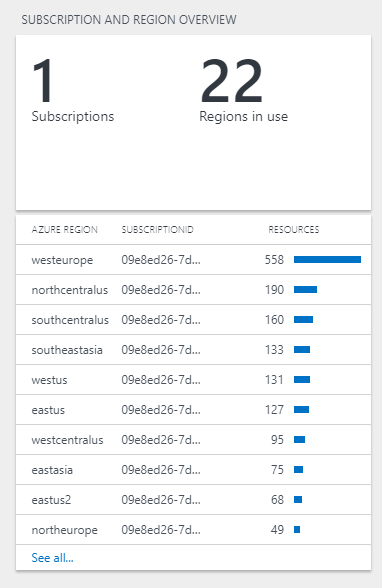

# Multi-tenant ARM analytics solution for Log Analytics; Turning the lights on
>Note: This is a community solution/prototype - and is not supported. Use it "as is", and feel free to improve and iterate on these building blocks yourself :-)

## What is this?

Have you ever wondered how many template deployments you have in your customer subscriptions? And whether these are successful or not?
Or perhaps you are trying to understand how many resources you have deployed, across resource providers and regions?

The "Multi-tenant ARM analytics solution" is a solution built on top of Log Analytics, which brings you information about your Azure Resource Manager deployments, resource locks, resource distribution and more!

## Deploy the solution

The template will deploy an Azure Management solution to a new or existing Log Analytics workspace, and use an Azure Automation runbook to collect the data from ARM APIs.

### Instructions

1. Deploy an Azure Automation account via the Azure **portal** - and remember to create a SPN RunAs Account during the process. The automation runbook will use the SPN to authenticate with ARM and collect the data.
2. Deploy the Azure Resource Manager template by clicking on the link below

## Exploring the solution

Once deployed, you can navigate to your Log Analytics workspace and locate the "Azure Resource Manager Analytics" solution resource.

Opening the solution, you will find additional views to call out the following:

* Overall deployment stats

Explore every template deployment across your subscription, to understand why some of these might be failing or are being canceled.

* Custom templates

Get detailed information about the templates you author and bring on your own, to understand their quality, success rate and more.

* First-party templates

Whenever you deploy from Azure portal, you will be invoking templates provided by Microsoft. The stats of those deployments are located here.

* Resource Overview

A quick look at this view, will give you an understanding of which resources are frequently being deployed.

* Resource Locks

If you use Resource Locks on your resources in production (you really should!), this view will show you which locks are applied, for which scope(s).

* Subscription and Region Overview

Shows resources distributed across Azure regions